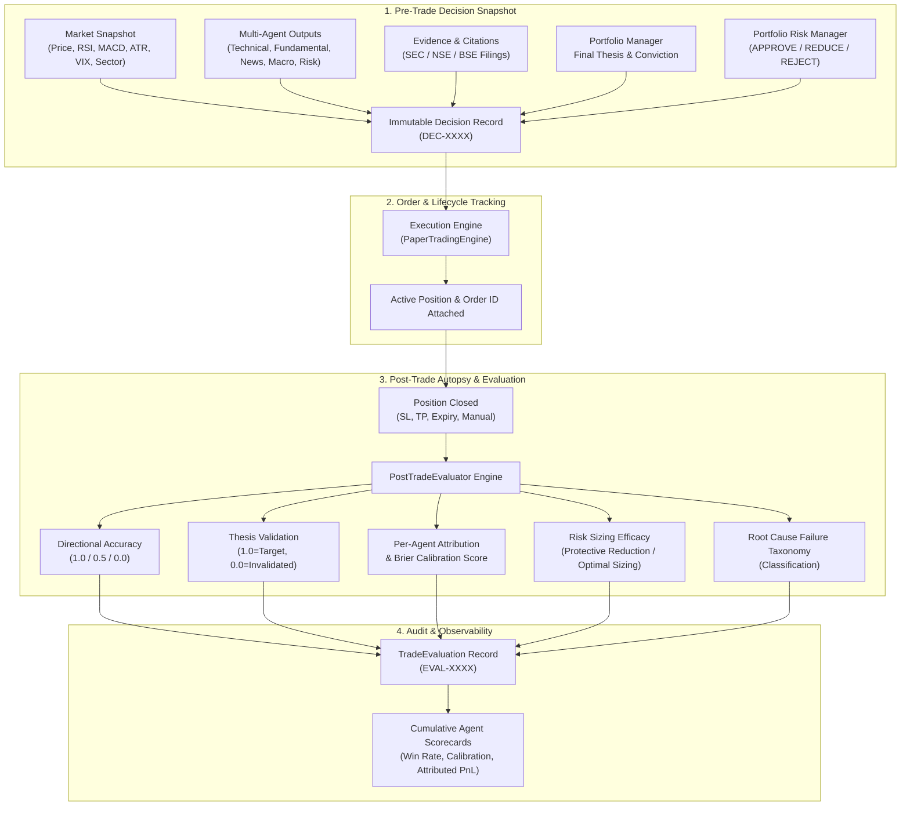
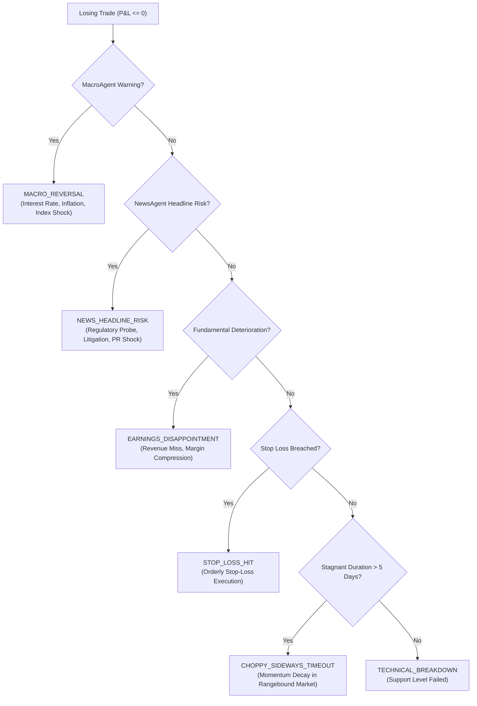

# Phase 7: Immutable Decision Journal & Agent Attribution Observability

---

## 1. Overview & Objective

The primary objective of **Phase 7** is establishing complete, immutable **measurement and observability** for every trade proposal and execution in Aegis.

Trading performance cannot be reliably improved without disciplined post-trade attribution and causal diagnosis. Before any optimization or automated learning occurs, the system must faithfully record:
1. Exactly what information, market snapshots, agent signals, and evidence citations existed when the trade was proposed.
2. What deterministic risk rules were checked, and what sizing decisions were enforced.
3. How the trade ultimately played out upon exit (directional accuracy, thesis validation, realized P&L).
4. Individual agent attribution scores and Brier score calibration.
5. Root cause failure classification according to a standardized taxonomy.

> [!IMPORTANT]
> **Strict Non-Interference Policy**: Agent weights and models are **NEVER** automatically retrained or dynamically altered by this system. Phase 7 is strictly an immutable observability and audit subsystem designed for diagnostic fidelity and performance measurement.

---

## 2. Architecture & Data Flow



---

## 3. Data Contracts & Schema

### 3.1. `DecisionJournalEntry` (Pre-Trade Snapshot)
Persisted in the `decision_journal` table in SQLite WAL mode:

| Column | Type | Description |
| :--- | :--- | :--- |
| `journal_id` | `TEXT PRIMARY KEY` | Unique decision UUID (e.g. `DEC-BE18DC90`) |
| `timestamp` | `TEXT` | Exact ISO 8601 UTC timestamp of signal generation |
| `symbol` | `TEXT` | Ticker symbol (e.g., `RELIANCE.NS`, `NVDA`) |
| `market` | `TEXT` | Market identifier (`india` or `us`) |
| `strategy` | `TEXT` | Active strategy mode (`swing`, `scalping`, `intraday`) |
| `direction` | `TEXT` | Action recommendation (`BUY`, `SELL`, `HOLD`) |
| `market_snapshot` | `TEXT (JSON)` | Price, RSI, MACD, ATR, 50/200-SMA, Sector, VIX |
| `agent_outputs` | `TEXT (JSON)` | Structured outputs from Technical, Fundamental, News, Macro, Risk, PM |
| `confidence` | `REAL` | Synthesized conviction score (0.0 – 1.0) |
| `evidence` | `TEXT (JSON)` | List of filing excerpts and verifiable data citations |
| `final_thesis` | `TEXT` | PM rationale and investment thesis |
| `risk_decision` | `TEXT` | `APPROVE`, `REDUCE`, or `REJECT` |
| `risk_reasons` | `TEXT (JSON)` | Deterministic checks violated or approved |
| `requested_quantity` | `INTEGER` | Quantity originally proposed |
| `approved_quantity` | `INTEGER` | Quantity approved by risk gatekeeper |
| `entry_price` | `REAL` | Reference entry price |
| `stop_loss` | `REAL` | Enforced stop loss boundary |
| `target_price` | `REAL` | Profit target price |
| `order_id` | `TEXT` | Associated order identifier |
| `position_id` | `INTEGER` | Associated position row ID |
| `status` | `TEXT` | `PROPOSED`, `EXECUTED`, `REJECTED`, `CLOSED` |
| `exit_price` | `REAL` | Filled exit price upon closure |
| `exit_timestamp` | `TEXT` | ISO timestamp of trade exit |
| `exit_reason` | `TEXT` | Cause of exit (e.g. `STOP_LOSS`, `TAKE_PROFIT`, `MANUAL`) |
| `realized_pnl` | `REAL` | Realized net P&L after brokerage and slippage |
| `return_pct` | `REAL` | Realized percentage return on invested margin |
| `holding_period_seconds` | `REAL` | Trade duration in seconds |

---

### 3.2. `TradeEvaluation` (Post-Trade Autopsy)
Persisted in the `trade_evaluations` table:

```json
{
  "evaluation_id": "EVAL-A1B2C3D4",
  "journal_id": "DEC-BE18DC90",
  "symbol": "RELIANCE.NS",
  "market": "india",
  "direction": "BUY",
  "realized_pnl": 20500.0,
  "return_pct": 8.2,
  "is_winner": true,
  "holding_period_seconds": 14400.0,
  "directional_accuracy": 1.0,
  "thesis_accuracy": 1.0,
  "thesis_notes": "Target price ₹/2700.00 reached. Core thesis fully validated.",
  "agent_accuracy": {
    "TechnicalAgent": {
      "agent_name": "TechnicalAgent",
      "signal": "BUY",
      "confidence": 0.85,
      "directional_accuracy": 1.0,
      "brier_score_loss": 0.0225,
      "notes": "TechnicalAgent correctly recommended BUY on upward move (+205.00)."
    },
    "FundamentalAgent": {
      "agent_name": "FundamentalAgent",
      "signal": "BUY",
      "confidence": 0.75,
      "directional_accuracy": 1.0,
      "brier_score_loss": 0.0625,
      "notes": "FundamentalAgent correctly recommended BUY on upward move (+205.00)."
    },
    "MacroAgent": {
      "agent_name": "MacroAgent",
      "signal": "HOLD",
      "confidence": 0.60,
      "directional_accuracy": 0.5,
      "brier_score_loss": 0.0100,
      "notes": "MacroAgent recommended HOLD, sitting out a winning trade."
    }
  },
  "risk_decision_evaluation": "OPTIMAL_SIZING: Risk engine approved full 100 shares. Maximized upside capture without violating portfolio limits.",
  "major_failure_reason": "NONE_WINNING_TRADE",
  "failure_details": "Trade achieved net positive profitability."
}
```

---

## 4. Evaluation Metrics & Methodologies

### 4.1. Directional Accuracy
Directional accuracy measures whether the market price moved favorably in the recommended trade direction:
- **BUY (LONG)**:
  $$\text{Directional Accuracy} = \begin{cases} 1.0 & \text{if } P_{\text{exit}} > P_{\text{entry}} \\ 0.5 & \text{if } P_{\text{exit}} = P_{\text{entry}} \\ 0.0 & \text{if } P_{\text{exit}} < P_{\text{entry}} \end{cases}$$
- **SELL (SHORT)**:
  $$\text{Directional Accuracy} = \begin{cases} 1.0 & \text{if } P_{\text{exit}} < P_{\text{entry}} \\ 0.5 & \text{if } P_{\text{exit}} = P_{\text{entry}} \\ 0.0 & \text{if } P_{\text{exit}} > P_{\text{entry}} \end{cases}$$

### 4.2. Thesis Accuracy
Evaluates the degree to which the quantitative investment thesis was achieved:
- **Full Target Hit (`1.0`)**: Target price reached or exceeded.
- **Stop Loss Hit (`0.0`)**: Price crossed stop loss; thesis invalidated.
- **Partial Profit Close (`0.0 – 1.0`)**: Pro-rata calculation of distance covered toward target:
  $$\text{Thesis Accuracy} = \min\left(1.0, \max\left(0.0, \frac{P_{\text{exit}} - P_{\text{entry}}}{P_{\text{target}} - P_{\text{entry}}}\right)\right)$$

### 4.3. Brier Calibration Score
Quantifies agent probability calibration (mean squared error between confidence $c_i$ and binary outcome $o_i \in \{0, 1\}$):
$$\text{Brier Loss} = (c_i - o_i)^2$$
- A lower Brier score indicates superior calibration.
- Perfect certainty on correct call ($c=1.0, o=1$) produces a loss of $0.0$.
- Overconfident incorrect calls ($c=0.9, o=0$) yield high penalties ($0.81$).

---

## 5. Root Cause Failure Taxonomy

When a trade closes at a loss ($P\&L \le 0$), the `PostTradeEvaluator` categorizes the failure into an unambiguous taxonomy:



---

## 6. Cumulative Agent Scorecards

The `DecisionJournalStore` dynamically computes performance scorecards for every agent across all historical decisions:

```python
scorecards = engine.get_agent_scorecards()
```

Each `AgentScorecard` reports:
- `total_evaluations`: Number of trades in which the agent participated.
- `bullish_calls` / `bearish_calls` / `neutral_calls`: Breakdown of agent recommendations.
- `win_rate`: Percentage of decisive calls where the agent was correct:
  $$\text{Win Rate} = \frac{\text{Correct Calls}}{\text{Correct Calls} + \text{Incorrect Calls}}$$
- `brier_calibration_score`: Cumulative mean Brier score indicating prediction reliability.
- `total_pnl_attributed`: Net currency gain/loss generated across all trades where the agent's signal aligned with position direction.
- `avg_return_when_bullish` / `avg_return_when_bearish`: Realized returns when agent was bullish vs bearish.

---

## 7. Verification & Testing

The test suite (`tests/test_phase7_journal.py`) verifies all Phase 7 requirements:

```bash
pytest tests/test_phase7_journal.py -v
```

### Test Coverage Highlights:
1. `test_record_and_retrieve_decision_journal`: Verifies SQLite storage and retrieval of market snapshot, multi-agent outputs, evidence citations, risk checks, and entry parameters.
2. `test_update_decision_execution_and_exit`: Validates lifecycle progression from `PROPOSED` to `EXECUTED` to `CLOSED`.
3. `test_post_trade_evaluator_winning_trade`: Asserts directional accuracy ($1.0$), thesis validation ($1.0$), Brier loss calculation, and failure classification (`NONE_WINNING_TRADE`).
4. `test_post_trade_evaluator_losing_trade_stop_loss`: Tests loss evaluation, thesis invalidation, and calibration penalties.
5. `test_failure_taxonomy_macro_reversal` & `test_failure_taxonomy_news_headline_risk`: Verifies automated causal failure categorization.
6. `test_risk_decision_protective_reduction`: Asserts risk analysis when position sizing was reduced, quantifying estimated capital saved.
7. `test_cumulative_agent_scorecards`: Validates multi-trade scorecard aggregation across agents.
8. `test_paper_engine_records_decision_and_evaluates_on_close`: End-to-end integration test from signal generation to automated post-mortem evaluation in `PaperTradingEngine`.
9. `test_short_position_evaluation`: Tests short trade directional accuracy and thesis scoring.
10. `test_immutability_and_no_weight_retraining`: Guarantees agent parameters and decision snapshots remain strictly immutable.

---

## 8. Summary Table of Completed Phases

| Phase | Description | Key Modules | Status |
| :--- | :--- | :--- | :--- |
| **Phase 1** | Portfolio Accounting & NAV | `src/trading/fees.py`, `src/trading/paper_engine.py` | ✅ Complete |
| **Phase 2** | Deterministic Backtesting Engine | `src/backtesting/` | ✅ Complete |
| **Phase 3** | Performance Metrics & Benchmarks | `src/evaluation/` | ✅ Complete |
| **Phase 4** | Multi-Agent Architecture & Local M5 Router | `src/agents/`, `src/gateway/` | ✅ Complete |
| **Phase 5** | Evidence-Grounded Financial RAG | `src/rag/` | ✅ Complete |
| **Phase 6** | Portfolio-Level Risk Management | `src/risk/` | ✅ Complete |
| **Phase 7** | Immutable Decision Journal & Observability | `src/journal/` | ✅ Complete |
